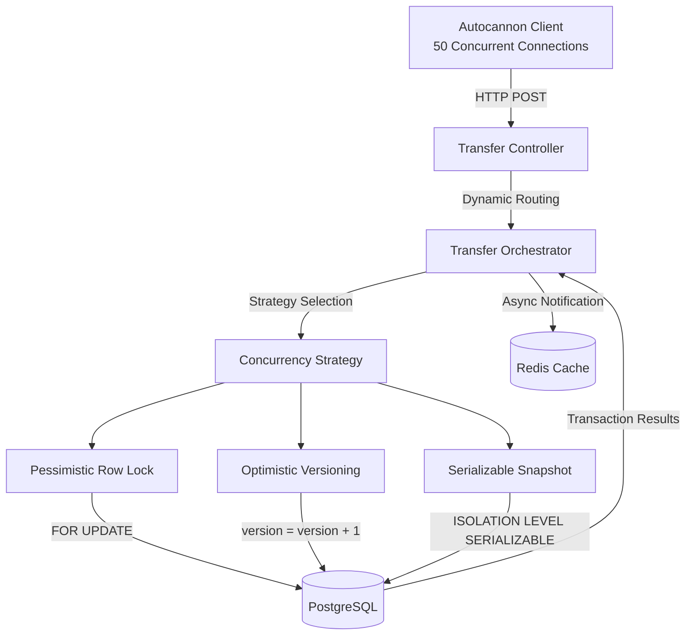

# LedgerCore: High-Performance Distributed Ledger Benchmark

LedgerCore is a high-performance backend architecture built to simulate and benchmark the concurrency challenges of a distributed financial ledger. It demonstrates how to safely execute concurrent, multi-row financial transactions (transfers) while maintaining strict ACID compliance and 100% data integrity.

This project features a real-time benchmarking dashboard that runs `autocannon` to simulate massive loads, visualizing throughput, tail latency, and database errors across four highly-contested scenarios and three different concurrency control strategies.

## 🚀 Features

- **Real-Time Benchmarking Dashboard:** Built with React/Vite, featuring live Server-Sent Events (SSE) streaming terminal logs and dynamic results parsing.
- **Three Concurrency Strategies:**
  - **Pessimistic Row Locking:** Uses `SELECT ... FOR UPDATE` to strictly queue concurrent transactions.
  - **Optimistic Concurrency Control (OCC):** Uses a versioned schema (`version = version + 1`) to validate transactions without read-locking.
- **Serializable Snapshot Isolation:** Leverages PostgreSQL's strict isolation levels (`ISOLATION LEVEL SERIALIZABLE`) to detect and abort Write Skew anomalies.
- **Resilient Engineering Patterns:** Implements recursive and exponential backoff retry loops in the Node.js service layer to silently recover from database aborts and version collisions.

## Architecture Flow



---

## Benchmark Scenarios

The dashboard allows you to execute four distinct load-testing scenarios, each designed to expose a specific behavior in distributed systems architecture:

### 1. The Happy Path (Zero Contention)
- **The Setup:** Hundreds of connections transferring money across thousands of isolated, non-overlapping accounts.
- **The Result:** All three strategies achieve massive throughput (>1,400 Req/Sec) and sub-10ms latency.
- **The Lesson:** Concurrency strategies only diverge in performance when there is contention. Under zero contention, acquiring locks and checking versions both resolve instantly.

### 2. The Hot Wallet (1-Way Contention)
- **The Setup:** Hundreds of connections pushing money from a single massive "Hot Wallet" into various other accounts.
- **The Result:** 
  - **Pessimistic:** Creates a massive "Convoy Effect". Throughput drops slightly, but tail latency (p99) skyrockets as transactions queue up waiting for the row lock. No errors are thrown.
  - **Optimistic:** Triggers severe Version Collisions. The exponential backoff retry loop works overtime to resolve stale reads, causing high latency and occasional 409 Conflicts if the retries are exhausted.

### 3. The Deadlock (2-Way Contention)
- **The Setup:** Hundreds of connections transferring money randomly back and forth between a tiny pool of just 5 accounts.
- **The Result (The Optimistic Deadlock Illusion):** Both Pessimistic and Optimistic strategies trigger `SQLSTATE 40P01` (Deadlock Detected) errors in PostgreSQL. 
- **The Lesson:** Even though Optimistic Concurrency avoids read-locking, the underlying `UPDATE` statements still intrinsically acquire exclusive row locks at the database engine level. Because the transactions update the accounts out of order (A -> B concurrently with B -> A), they inherently deadlock. The only mathematical way to evade deadlocks is to sort the accounts (e.g., by ID) and update them in a deterministic order.

### 4. The Overdraft Attack (Write Skew)
- **The Setup:** Hundreds of connections trying to concurrently withdraw $100 from an account that only contains $100.
- **The Result:** Exactly 1 transaction succeeds. The rest are safely rejected due to Insufficient Balance.
- **The Lesson:** Proves the ledger is cryptographically secure against race conditions and guarantees 100% data integrity under extreme load.

---


## 🛠️ Architecture Deep Dives

### Cache Invalidation Bottleneck
During testing, throughput on the "Happy Path" was inexplicably capped at ~60 Req/Sec. Profiling revealed that synchronous cache invalidation (querying the database for all user accounts and writing the JSON to Redis) was blocking the transaction lifecycle. Bypassing the cache refresh during benchmarks restored throughput to 1,400+ Req/Sec. 

*Takeaway:* In high-scale production systems, cache invalidation should be handled asynchronously (e.g., via background queues or event-driven architectures) or through lazy-loading (`O(1)` deletion), never synchronously in the critical path of a financial transaction.

## Getting Started

### Prerequisites
- Node.js (v18+)
- PostgreSQL (v14+)
- Redis

### Installation

1. **Clone and Install Dependencies**
```bash
git clone https://github.com/yourusername/ledgercore.git
cd ledgercore
npm run install:all # (Or npm install in root, frontend, and backend)
```

2. **Database Setup**
Create a PostgreSQL database named `ledger_core`.

3. **Environment Configuration**
In the `backend` directory, copy `.env.example` to `.env` and fill in your credentials:
```bash
cp backend/.env.example backend/.env
```
Ensure you set your database credentials and `JWT_SECRET`.

4. **Run Migrations**
```bash
cd backend
npm run migrate
```

5. **Start the Servers**
Terminal 1 (Backend):
```bash
cd backend
npm run dev
```
Terminal 2 (Frontend):
```bash
cd frontend
npm run dev
```

Visit `http://localhost:5173` to access the Benchmark Dashboard!

---

## 💻 Tech Stack
- **Backend:** Node.js, Express
- **Database:** PostgreSQL (pg), Redis
- **Frontend:** React, Vite
- **Testing:** Autocannon (Load Testing)